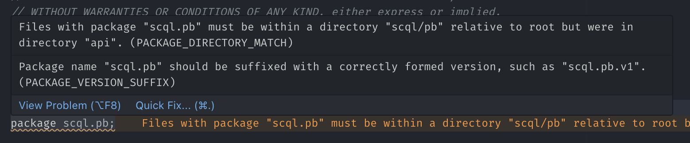

# DEMO

This fork contains a demo of Protobuf/gRPC related workflows using [Buf][buf].
Buf provides one-stop support for invoking `protoc`, managing `protoc` plugins,
as well as external `.proto` files through [BSR][bsr].

This is currently a **proof of concept** and is **not production-ready**.

[buf]: https://buf.build/
[bsr]: https://buf.build/docs/bsr/introduction

Compare with upstream:
<https://github.com/secretflow/scql/compare/main...tonywu6:scql:main>

## References

- [Buf documentation][buf-docs]
- [gRPC Gateway][grpc-gateway]: gRPC to REST and Swagger
- [gnostic][gnostic]: gRPC to OpenAPI v3.0

[buf-docs]: https://buf.build/docs/introduction
[grpc-gateway]: https://grpc-ecosystem.github.io/grpc-gateway/
[gnostic]: https://github.com/google/gnostic

## Requirements

Buf CLI:

```bash
go install github.com/bufbuild/buf/cmd/buf@v1.28.1
```

The [Buf VS Code extension][buf-vscode] is recommended.

[buf-vscode]:
  https://marketplace.visualstudio.com/items?itemName=bufbuild.vscode-buf

## General workflow

Feel free to consult <https://buf.build/docs/introduction> for authoritative
information on Buf. The following are changes specific to this project.

- Run `buf generate` to generate code from `.proto` files; see
  [buf.gen.yaml](#bufgenyaml)
- Run `buf mod update` to update proto dependencies; see [buf.yaml](#bufyaml)

## Output

The results of `buf generate` are checked in to the repository:

- `/gen/go` — generated Go code
  - `**/*.pb.go`
  - `**/*_grpc.pb.go` — gRPC stubs
  - `**/*_pb.gw.go` — gRPC-Gateway stubs
- `/gen/openapiv2` — Swagger docs, generated by a plugin from [gRPC
  Gateway][grpc-gateway]
- `/gen/openapiv3` — OpenAPI v3.0 docs, generated by a plugin from
  [gnostic][gnostic]

**It is recommended that generated code be checked in to the repository.**

**It is recommended that `buf generate` be run as part of the CI workflow.**

## HTTP API

`api/scdb_api.proto` has the following modification:

```diff
  // in api/broker.proto:
  import "api/status.proto";
+ import "google/api/annotations.proto";
  import "google/protobuf/empty.proto";
  // ...
  service SCDBService {
    // ...
-   rpc SubmitAndGet(SCDBQueryRequest) returns (SCDBQueryResultResponse);
+   rpc SubmitAndGet(SCDBQueryRequest) returns (SCDBQueryResultResponse) {
+     option (google.api.http) = {
+       post: "/public/submit_and_get"
+       body: "*"
+     };
+   }
    // ...
  }
  // ...
```

**Endpoints annotated as such will be picked up by `protoc` plugins and included
in Swagger/OpenAPI outputs.**

Note that **ONLY** endpoints annotated directly in `.proto` files will be
discovered. `protoc` plugins will not look at custom-written clients (e.g.
`pkg/scdb/client/client.go`).

The above modification results in:

`gen/openapiv2/api/scdb_api.swagger.json` (by gRPC Gateway)

```json
{
  "swagger": "2.0",
  "info": {
    "title": "api/scdb_api.proto",
    "version": "version not set"
  },
  "paths": {
    "/public/submit_and_get": {
      "post": {
        "summary": "The synchronous query interface allows users to ..."
      }
    }
  }
}
```

`gen/openapiv3/openapi.yaml` (by gnostic)

```yaml
# Generated with protoc-gen-openapi
# https://github.com/google/gnostic/tree/master/cmd/protoc-gen-openapi

openapi: 3.0.3
info:
  title: ''
  version: 0.0.1
paths:
  /public/submit_and_get:
    post:
      tags:
        - SCDBService
      description: |-
        The synchronous query interface allows users to submit a query,
         wait for it to finish, and get the query result in one RPC.
         ...
```

There are likely a lot more customization options available and further
investigation of [gRPC Gateway][grpc-gateway] and [gnostic][gnostic] is
recommended.

## Buf configuration

### `/buf.yaml`

```yaml
version: v1
name: buf.build/secretflow/scql
deps:
  # - buf.build/secretflow/spu
  - buf.build/googleapis/googleapis
# ...
```

This file indicates the root of the Buf workspace. Workspaces **dictate `.proto`
import paths.**

#### `deps`

This section indicates the dependencies of the workspace.

Here, the `buf.build/googleapis/googleapis` dependency enables us to

```proto
import "google/api/annotations.proto";
```

in a `.proto` file without checking out Google's repository locally.

In the future, we could maybe publish all SecretFlow repos to BSR.

### `/buf.gen.yaml`

```yaml
version: v1

managed:
  enabled: true
  go_package_prefix:
    # determines the Go package prefix for the generated Go code
    default: github.com/secretflow/scql/gen/go
    except:
      # keep the original package name for Google-authored .proto files
      - buf.build/googleapis/googleapis

plugins:
  - plugin: buf.build/protocolbuffers/go:v1.31.0
    # = protoc-gen-go
  - plugin: buf.build/grpc/go:v1.3.0
    # = protoc-gen-go-grpc
  - plugin: buf.build/grpc-ecosystem/gateway:v2.18.1
    # gRPC-Gateway stubs
  - plugin: buf.build/grpc-ecosystem/openapiv2:v2.16.2
    # Swagger docs (via gRPC-Gateway)
  - plugin: buf.build/community/google-gnostic-openapi:v0.7.0
    # OpenAPI v3.0 docs
```

`buf generate` essentially runs `protoc`. `buf.gen.yaml` specifies all options
necessary to run `protoc` with the desired plugins.

Plugins with names prefixed with `buf.build/` are "remote plugins". They are
automatically managed by Buf and do not need to be installed locally.

## TODO:

### Bazel interop and external .proto files

We already has Bazel as a build system, and currently `protoc`-related tasks are
managed through `bazel build` _(which includes building the entire gRPC
toolchain from scratch)_:

```bash
bazel build //api:scql_go_proto //api:spu_go_proto
```

Crucially, **this demo checked `libspu/spu.proto` into the repo.** This would
not have been necessary if `spu` were available on the [BSR][bsr], in which case
we could configure `buf.yaml` as such:

```diff
  version: v1
  name: buf.build/secretflow/scql
  deps:
+   - buf.build/secretflow/spu
    - buf.build/googleapis/googleapis
```

Fetching extern source trees was previously handled by Bazel. How to configure
Buf and Bazel to work together?

Alternatively, since Buf ultimately invokes `protoc` with plugins, we could
update Bazel targets to use the additional Gateway/OpenAPI plugins — **but this
would require a lot of manual work.**

### Linting

If you are on VS Code and have installed the [Buf VS Code
extension][buf-vscode], after running `buf generate` or `buf build` at least
onces, you might see warnings in your `.proto` files.

For example, the following warning recommends `api/broker.proto` be **placed at
`scql/pb/broker/v1.proto` and use `package scql.db.broker.v1;` instead**:



Read more about Buf's linting and recommendations [here][buf-linting]. Package
owners should decide on whether to adopt stricter standards.

[buf-linting]: https://buf.build/docs/lint/overview
